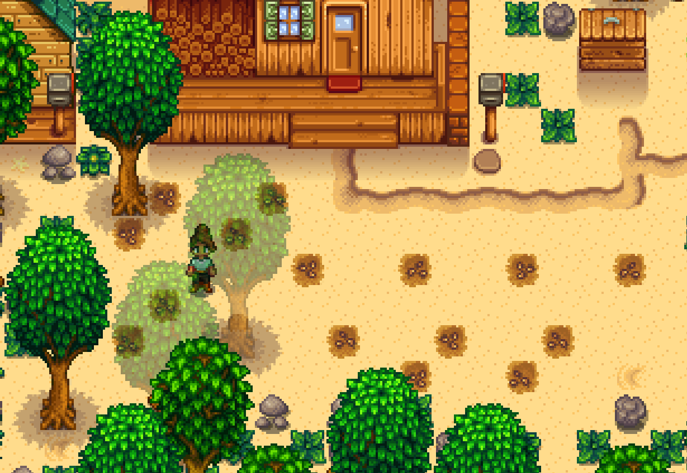

TODO: Fix planting parsnip image
TODO: Add Pumpkin planting image

# Abigail Marriage 

## Required Tech
- [Winter Forage Farming](../../tech/winter_forage_farming.md)
- [Rain Prediction](../../tech/rain_prediction.md)
- [Golden Crop Manipulation](../../tech/golden_crop_manipulation.md)
- [Parsnip Punching](../../tech/parsnip_punching.md)

## Setup

Play as: Girl  
Farm: Beach Farm  
Patch: 1.6 with Legacy RNG  

## Miscellaneous notes

- This route calls for all golden quality pumpkins for gifting, but up to 3 regular quality pumpkins are fine as long as they are not gifted on birthdays.

## Route

### Spring 1, Y1
- Plant parsnips
  ```
  ~HHHHSSSHHM~~~P~~~
  ~~~~~~P~~~P~~~PPPP
  T@~~@~PPPPPPPPP~~~
  @~~@~~~~~~~~~~~~~~
  ~~~~~~~~~~~~~~~~~~
  ~~~~~~~~~~~~~~~~~~
  ~@~~~~~~~~~~~~~~~~
  @~~T~~@@@@@@@~~~~~
  ~~~~~~~~@~~@~~~~~~
  
  Legend:
  H: House
  S: House Step
  M: Mailbox
  P: Path
  T: Tree
  @: Parsnip planting spot
  ```
  


- Sleep

- Reset on Sunny 7th
- Reset on Sunny 9th
- Reset on Rainy 15th

### Spring 27, Y1
- Harvest parsnips
- Mark Gold parsnip location
- Reset if no gold parsnip
- Sleep

### Fall 1, Y1
- Clear out space for crops
- Water all spaces
- Fertilize all spaces with basic fertilizer (crafted from sap), except for **B**
- Go to Pierre's at 9am
- DO NOT TALK TO PIERRE
- Sell all parsnips
- Buy 8 pumpkin seeds and 1 speed-gro
- Plant all pumpkin seeds and speed-gro **B**
- Sleep
```
8~~8~~
~~~@~~
7~~7~B
~~~~~7
8~~8~~

Legend:  
@: Gold quality parsnip spot  
7: Plant pumpkin here, harvest on 27th  
8: Plant punpkin here, harvest on 28th  
B: Plant pumpkin here and use speed-gro, harvest on 13th (Birthday pumpkin)
```

### Fall 3 through 12, Y1
- Count rain days
- Water B and nothing else
- Sleep

### Fall 13, Y1
- Harvest **B**
- Till for a single clay near the mailbox (to set up winter forage) 
  
  ```
  ~~~~~
  ~~~~~~~~~~~~
  ~~M~~~#~~~~~
  ~~#~@~PPPPPP
  PPPPPPP~~~~~
  ~~~~~~~~~~~~

  Legend:
  M: Mailbox
  P: Path
  ~: Beach
  @: Spot to till
  ```
- Chop trees as time permits
- Gift pumpkin outside of Abigail's bedroom at 9am
- Pass out

Start watering all pumpkins on the 15th (+ any rain days)

### Fall 27, Y1
- Harvest pumpkins marked 7
- Sleep
```
8~~8~~
~~~@~~
7~~7~~
~~~~~7
8~~8~~
```

### Fall 28, Y1
- Harvest remaining pumpkins
- Sleep

### Winter 12, Y1
- Read single letter from mailbox for fishing rod
- Winter forage farm (66). If clay manip was done, start on tile pictured below:
  
- Gift pumpkin in Abigail's bedroom at 9am or in Pierre's kitchen after that
- Pass out

### Winter 13, Y1
- Winter forage farm (66)
- Gift pumpkin in Abigail's bedroom at 9am
- Pass out

### Winter 14, Y1
- Winter forage farm (66)
- Gift pumpkin in Abigail's bedroom at 9am
- Answer her question with option 2: "I like the orc with the battleaxe."
- Pass out

### Spring 24, Y2
- Chop trees (should get at least 300 wood)
- If time permits, break crates on the beach for coffee
- Gift outside of Pierre's at 10:30am
- Flower dance
- Talk to everyone (except for Pierre, we get Pierre later)
- Sleep

### Fall 13, Y2
- Chop trees (absolutely need 450 wood before leaving farm)
- Drink coffee at 8:50am if you have any
- Gift pumpkin in Abigail's bedroom at 9:00am
- Sell 10,200 worth of winter forage to Pierre
- Buy bouquet
- Go to Robins and upgrade house
- Pass out

### Fall 18, Y2
- Chop trees
- Bouquet + Gift pumpkin in Abigail's bedroom at 9:00am
- Pass out

### Fall 19, Y2 (Should be raining)
- Read mail for up to 1000g if necessary (5000g required for pendant)
- Chop trees if necessary (300 wood required for bridge)
- Gift pumpkin in Abigail's bedroom at 9:00am
- TALK TO PIERRE
- Sell all remaining winter forage to Pierre
- Buy Mermaid's Pendant
- Propose
- Pass out and sleep until win
