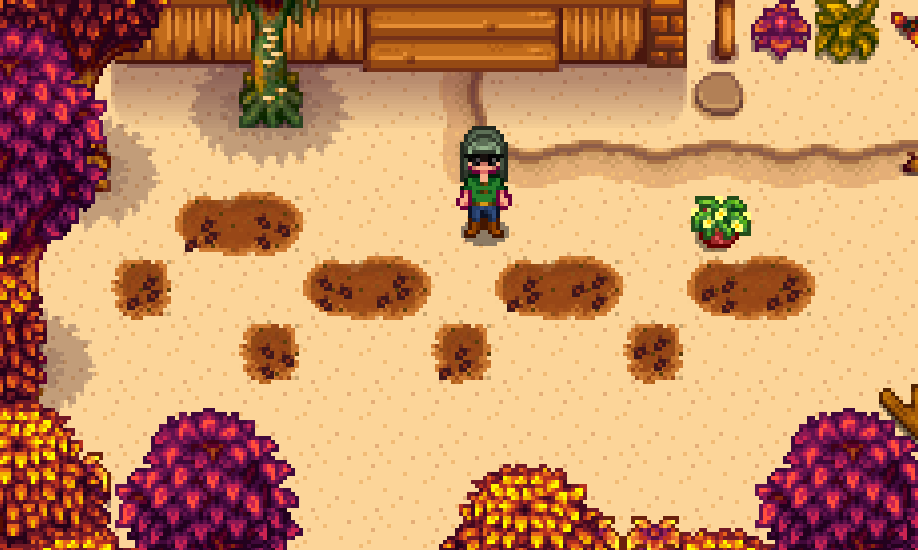
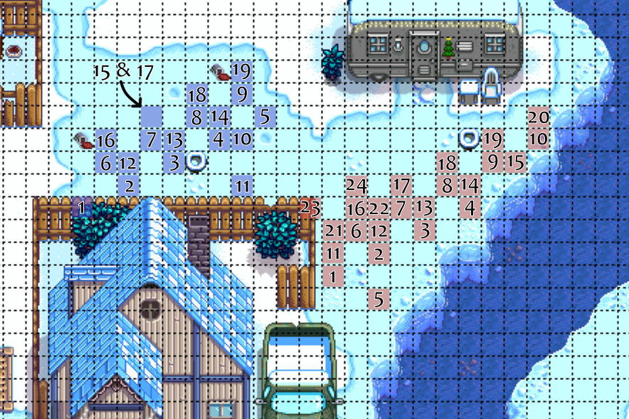

# Alex Marriage 

[Video of run](https://youtu.be/E7758iuytcg)

## Required Tech
- [Winter Forage Farming](../../tech/winter_forage_farming.md)
- [Golden Crop Manipulation](../../tech/golden_crop_manipulation.md)

## Setup

Play as: Girl  
Farm: Beach Farm  
Patch: 1.6 with Legacy RNG

## Miscellaneous notes

This route takes advantage of specific dialogue options that Alex gives on Wednesdays in spring, summer and fall. Unfortunately, there is a 2.5% chance that whenever you talk to Alex, he will tell you about one of his relatives likes or dislikes instead. If this happens, you will need to go out on an extra day and gift one of the leftover regular parsnips.

## Route

### Spring 1, Y1
- Plant all parsnips
- Sleep

### Spring 28, Y1
- Harvest all parsnips
- Mark Gold parsnip location
- Reset if no gold parsnip
- Sleep

### Summer 13, Y1
- Read single letter from mailbox for fishing rod
- Immediately go to beach for fishing rod
- Gift Gold parsnip and talk to Alex in his house at 8am
- Pass out

### Summer 17, Y1
- If it is raining, do this day on summer 24 instead (non-raining Wednesday)
- Clear space for future planting around gold quality spots
- Chop trees as able
- Gift regular parsnip and talk to Alex in his house at 8am
- Answer Alex with option 1: "You're destined to be a sports legend"
- Pass out

### Fall 1, Y1
- Clear space for future planting around gold quality spots
- Chop trees as able
- Gift regular parsnip and talk to Alex outside his house at 8:30am
- Go to Pierre's
- TALK TO PIERRE
- Sell 6 parsnips, buy 12 bok choy seeds
- Pass out

### Fall 3, Y1
- Craft 12 basic fertilizer from sap
- Plant, water and fertilize 12 bok choy
  
  ```
  ~81~~~~~~@~
  4~~81~81~81
  ~~4~~4~~4~~
  
  Legend:
  @: Gold quality parsnip spot  
  7: Plant bok choy here, harvest on 21st
  8: Plant bok choy here, harvest on 24th  
  B: Plant bok choy here, harvest on 28th
  ```
- Chop trees as able
- Gift regular parsnip and talk to Alex in his house at 8am
- If Alex asks, answer with option 1: "It looks very fashionable."
- Pass out

### Fall 15, Y1
- Water bok choy
- Chop trees
- Gift regular parsnip and talk to Alex in his house at 8am
- Pass out

### Fall 17, Y1
- Water bok choy
- Chop trees
- Gift regular parsnip and talk to Alex in his house at 8am
- If Alex asks, answer with option 1: "It looks very fashionable."
- Pass out

### Fall 21, Y1
- Harvest bok choy marked "1" (should all be gold)
  ```
  ~81~~~~~~@~
  4~~81~81~81
  ~~4~~4~~4~~
  ```
- Chop trees
- Gift bok choy and talk to Alex in his house at 8am
- Pass out

### Fall 24, Y1
- Harvest bok choy marked "4" (should all be gold)
  ```
  ~81~~~~~~@~
  4~~81~81~81
  ~~4~~4~~4~~
  ```
- Chop trees
- Gift bok choy and talk to Alex in his house at 8am
- If Alex asks, answer with option 1: "It looks very fashionable."
- Pass out

### Fall 28, Y1
- Harvest remaining bok choy (should all be gold)
- Sleep

### Winter 5
- Winter forage farm outside of Alex's house (19 -> 1)
  
- Gift bok choy and talk to Alex in his house at 8am
- Pass out

### Winter 6
- Winter forage farm outside of Alex's house (19 -> 24)
- Gift bok choy and talk to Alex in his house at 8am
- Pass out

### Winter 7
- Winter forage farm outside of Alex's house (19 -> 13)
- Gift bok choy and talk to Alex in his house at 8am
- Pass out

### Winter 19, Y1
- Winter forage farm outside of Alex's house (19 -> 1)
- Gift bok choy and talk to Alex in his house at 8am
- Pass out

### Winter 20, Y1
- Winter forage farm outside of Alex's house (19 -> 24)
- Gift bok choy and talk to Alex in his house at 8am
- Pass out

### Winter 21, Y1
- Ship all winter forage
- Winter forage farm outside of Alex's house (19 -> 24)
- Enter Alex's house at 8am and DO NOT SKIP THE CUTSCENE
- Pick option 2: "We all have our strengths and weaknesses."
- Skip the cutscene as soon as you choose the text option
- Gift bok choy and talk to Alex in his house
- Pass out

### Winter 22, Y1
- Winter forage farm outside of Alex's house (19 -> 24)
- Gift bok choy and talk to Alex in his house at 8am
- Go to Robin's
- Spend all but 10,000g buying wood from Robin, then upgrade house
- Pass out

### Spring 22
- Chop trees
- Gift bok choy and talk to Alex in his house at 8am
- Pass out

### Spring 24
- Chop trees
- Gift bok choy and talk to Alex outside his house at 8:30am
- Pick option 2: "I want to play catch with you!"
- Flower dance
- Talk to everyone
- Sleep

### Summer 13
- Chop trees until 300 wood
- Go to Pierre's at 9am
- Sell everything (except for single bok choy) to Pierre, buy bouquet
- Gift bouquet, then bok choy, then talk to Alex in his house
- Buy Mermaids Pendant
- Propose
- Pass out
- Sleep until win
