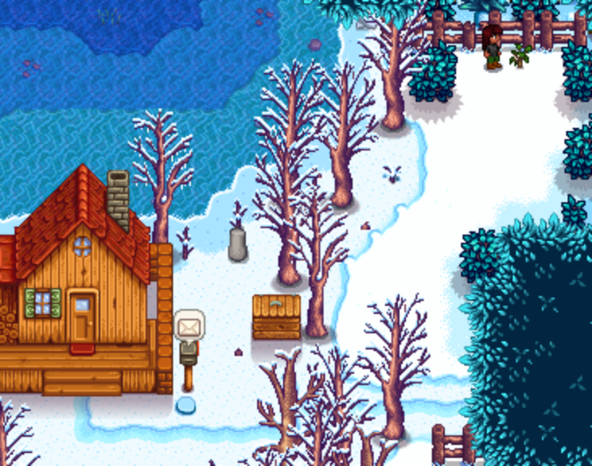

# Elliott Marriage 

No Video of run :(

## Required Tech
- [Winter Forage Farming](../../tech/winter_forage_farming.md)
- [Rain Prediction](../../tech/rain_prediction.md)
- [Golden Crop Rain Relation](../../tech/golden_crop_rain_relation.md)

## Setup

Play as: Girl  
Farm: Beach Farm  
Patch: 1.6 with Legacy RNG

## Route

### Spring 1, Y1
- Plant 7 parsnips
  ```
  ~~~HHHHHHHHH~~~~~~~
  ~~~HHHHSSSHHM~~~~~~
  ~~~~~~~~P~~~P~~~PPP
  ~~T~~~@~PPPPPPPPP~~
  ~~~~~@~~@~~@~~@~~~~
  ~~~~~~~~~~@~~@~~~~~
  Legend:
  H = House
  S = Steps of house
  M = Mailbox
  P = Path
  T = Tree
  @ = Plant parsnip here
  ```
- Sleep
 

- Reset if rainy 6th
- Reset if sunny 7th

### Spring 27, Y1
- Harvest all parsnips
- Reset if no gold parsnip
- Sleep

### Fall 5, Y1
- Chop trees
- Harvest clay on the beach 1 tile up from regular pattern start
- Gift gold parsnip and talk to Elliott outside his cabin at 11am
- Pass out

### Fall 6, Y1
- Step outside, get training rod from Willy
- Sleep

### Winter 12, Y1
- Drink coffee if available
- Winter forage farm on the beach (43)
- Gift regular parsnip and talk to Elliott outside his cabin at 8am
- Pass out

### Winter 13, Y1
- Winter forage farm on the beach (66), starting from the same tile.
- Gift parsnip at 8:00am
- Go to Pierre's
- Sell exactly 6,000g worth of winter forage
- Buy pomegranate sapling
- Pass out

### Winter 14, Y1
- Plant pomegranate sapling at back of spouse area (to keep safe from debris)
  
- Sleep

### Fall 5, Y2
- Chop Trees
- Harvest pomegranates
- Gift pomegranate and talk to Elliott outside his cabin at 11am
- Pass out

### Fall 8, Y2
- Harvest pomegranates
- Sleep

### Winter 12, Y2
- Drink coffee if available
- Winter forage farm on the beach (66), starting from the same tile.
- Gift pomegranate and talk to Elliott outside his cabin at 8am
- Pass out

### Winter 13, Y2
- Winter forage farm on the beach (66), starting from the same tile.
- Gift pomegranate and talk to Elliott outside his cabin at 8am
- Pass out

### Spring 24, Y3
- Put exactly 10,000g worth of winter forage into the shipping bin
- Chop trees
- Gift pomegranate and talk to Elliott outside his cabin at 12:00pm
- Flower dance
- Talk to everyone (except for Pierre)
- Dance with Elliott
- Sleep

### Fall 5, Y3
- Harvest silver pomegranates
- Chop trees (including pomegranate sapling)
- Upgrade house at Robin's at 9am
- Enter Elliott's cabin at 10am and DO NOT SKIP THE CUTSCENE
- Pick any option: "Mystery", "Romance", or "Sci-Fi"
- Skip the cutscene as soon as you choose the text option
- Gift silver pomegranate and talk to Elliott

### Rest of fall
- We are going out 2 more times in fall: the day before it rains, and then a rainy day
- Given the rain prediction that we did, do the following:
  - If it rains on the 12th, go out on the 13th. It will rain on the 14th.
  - If it doesn't rain on the 12th, check the forecast for rain on the 13th. If the forecast shows rain, go out on the 13th.
  - Otherwise, go out on the 17th. It will rain on the 18th.

### Day before rainy day, Y3
- Chop trees
- Buy bouquet from Pierre at 9am (sell winter forage if necessary)
- Gift silver pomegranate and talk to Elliott in his cabin at 10am
- Sleep

### Rainy day, Y3
- Check mail for up to 1,000g if necessary (need 5,000g)
- Chop trees as necessary (need 300 wood)
- Talk to Pierre at 9am
- Sell everything (winter forage, pomegranate sapling) to Pierre
- Gift silver pomegranate and talk to Elliott in his cabin at 10am
- Buy mermaids pendant
- Propose
- Pass out
- Sleep until win
