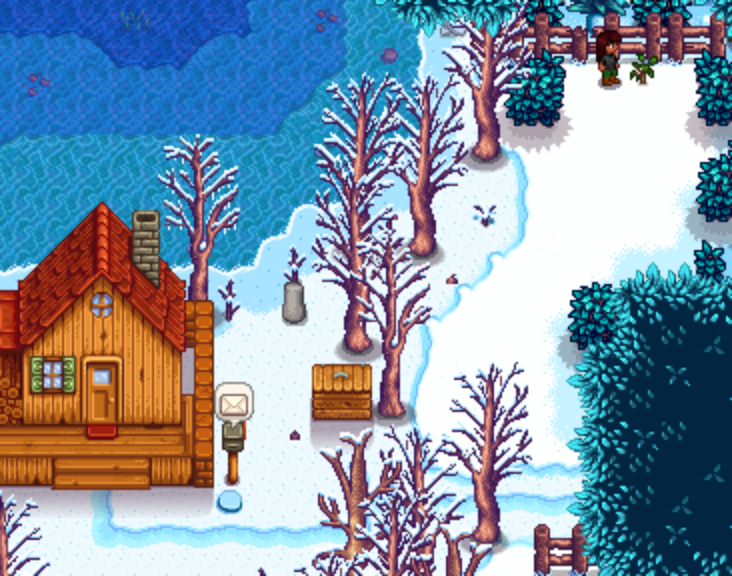

# Emily Marriage 

[Video of run](https://youtu.be/5VMDdIt1mdY?si=npPYr-DrsHDb8_sq&t=4265)

## Required Tech
- [Winter Forage Farming](../../tech/winter_forage_farming.md)
- [Crate Manipulation](../../tech/crate_manipulation.md)
- [Parsnip Punching](../../tech/parsnip_punching.md)
- [Mail Manipulation](../../tech/mail_manipulation.md)
- [Rain Prediction](../../tech/rain_prediction.md)

## Setup

Play as: Girl  
Farm: Beach Farm  
Patch: 1.6 with Legacy RNG

## Miscellaneous notes

Emily loves:
- Amethyst, topaz, and other gems
- Survival Burger (which can be found in crates on the beach farm)
- Wool and Cloth (which Emily will send you in the mail)

Unlike most marriage routes which collect a consistent amount of gifts, all of Emily's gifts come from random sources. You'll need to use your judgement to decide if you have enough gifts or if you should spend time extra time mining or resetting mail. Keep the following in mind:
- You need 7 gifts total + 1 amethyst for the entire run.
- You can get away with a single liked gift as long as it's not given on a birthday (Spring 27) and everything else is loved. Emily likes both quartz and daffodils which are easy to come by. Recommend gifting one of these on Winter 6, Y1.
- You need at least 1 amethyst for quest purposes, do not leave the mines without one.
- On Spring 27, Y1, 2 loved gifts + 1 amethyst is usually good enough to finish the run with mail and crates, 3 gifts + 1 amethyst is very good.
- On Winter 6, when checking mail, you need 5 gifts + 1 amethyst to get through winter, consider resetting mail if you do not have enough. You do get to check crates on the beach also.

## Route

- Sleep until Spring 27
- Reset on sunny 7th
- Reset on rainy 15th
- Reset on sunny 26th

### Spring 27, Y1
- Go to mines, get to floor 5
- Reset floor 5 for amethyst
  
- Punch dwarf rock down to 1 stamina
- Gift a loved gift and talk to Emily outside of her bedroom at 12pm
- Pass out

### Winter 6, Y1
- Punch parsnips to roughly half stamina
- Read all mail, reset day for loved gifts if necessary
- Leave via south exit on farm, breaking beach crates
- Winter forage farm on the beach (8 or 31 if time permits)
- Gift a loved gift AND an amethyst and talk to Emily in her bedroom at 9am
- Pass out

### Winter 7, Y1
- Step outside of cabin to get training rod
- Sleep

### Winter 19, Y1
- Punch parsnips to half stamina
- Winter forage farm on the beach (66), starting from the same tile.
- Gift a loved gift and talk to Emily in her bedroom at 9am
- Pass out

### Winter 20, Y1
- Winter forage farm on the beach (66), starting from the same tile.
- Gift a loved gift and talk to Emily in her bedroom at 9am
- Pass out

### Winter 21, Y1
- Winter forage farm on the beach (66), starting from the same tile.
- Drink coffee at 8:50 if available
- Gift a loved gift and talk to Emily in her bedroom at 9am
- Go to Pierre's
- Sell all winter forage and buy Apricot Sapling
- Go to Robin's
- Spend all but 10,000g buying wood from Robin, then upgrade house
- Pass out

### Winter 22, Y1
- Plant Apricot Sapling at back of spouse area (to keep safe from debris)
  
- Winter forage farm on the beach (66), starting from the same tile.
- Gift a loved gift and talk to Emily in her bedroom at 9am
- Pass out

### Spring 24, Y2
- Read all mail, reset day for loved gifts if necessary
- Chop trees
- Collect beach crates for speed food, as time permits
- Flower dance at 9am
- Talk to Everyone (except for Pierre)
- Dance with Emily
- Sleep

### Spring 27, Y2
- Consume speed food at start of day
- Chop trees as necessary (need 300 wood), chop apricot sapling
- Gift a loved gift to Emily in her bedroom at 9am
- Go to Pierre's
- TALK TO PIERRE
- Sell all winter forage and apricot sapling, buy bouquet
- Gift a bouquet and an apricot and talk to Emily in her bedroom
- Buy Mermaids pendant
- Propose
- Pass out
- Sleep until win
