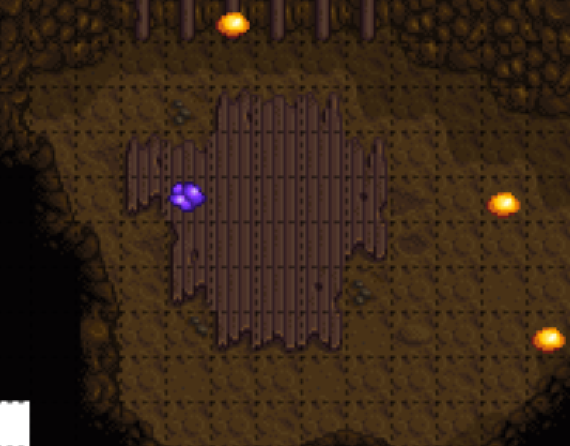

Spring 27
- Read mail
- Check beach forage
- Go mining for amethyst

- Get Fishing rod from beach
- Gift Emily at 12pm
- Pass out

-############-
Summer 1
- Get Training Rod

Summer 22
Hold Escape

-############-

Winter 12
- Check mail
- Clay farm (66)
- Gift Emily at 9am, Amethyst
- Pass out

Winter 13
- Clay farm (66)
- Gift Emily at 9am
- Pass out

Winter 14
- Clay farm (66)
- Gift Emily at 9am
- TALK TO PIERRE
- Sell all forage and buy Apricot Sapling
- Upgrade House
- Pass out

Winter 15
- Plant Apricot Sapling
- Clay farm (66)
- Gift Emily at 9am
- Pass out

-############-
Spring 24
- Check mail
- Chop trees
- Gather beach forage, if necessary
- Flower dance at 9am
- Talk to Everyone
- Sleep

Spring 27
- Chop trees (Chop Apricot sapling)
- Birthday Gift Emily
- Go to Pierres, sell all, buy bouquet
- Pass out

Rain Day
- Bouquet, Apricot, Loved Gift, Talk if necessary
- Buy Mermaids pendant
- Propose
- Pass out

- Sleep until win
