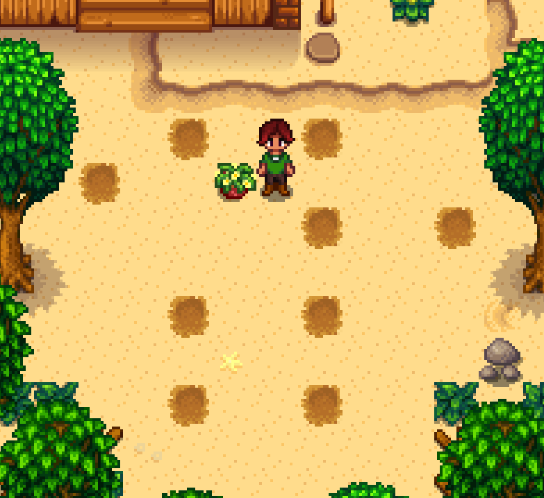
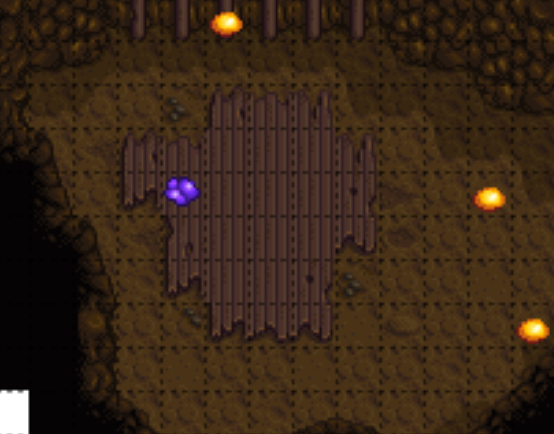
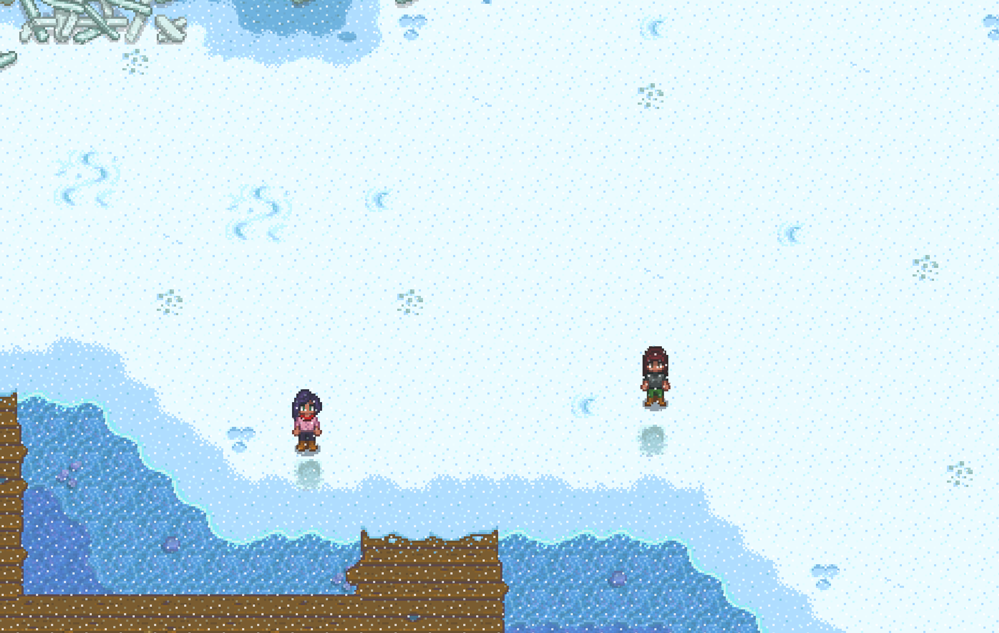

# 2 Player Marriage (Emily / Maru) Emily Notes

To be paired with [Maru Notes](./stardew_marriage_2p_intermediate_maru.md)

## Required Tech
- [Winter Forage Farming](../../../tech/winter_forage_farming.md)
- [Crate Manipulation](../../../tech/crate_manipulation.md)
- [Parsnip Punching](../../../tech/parsnip_punching.md)
- [Mail Manipulation](../../../tech/mail_manipulation.md)

## Setup

Emily Player should host the file
Play as: Girl  
Farm: Beach Farm  
Patch: 1.6 with Legacy RNG  

## Miscellaneous notes

Emily loves
- Amethyst, topaz, and other gems
- Survival Burger (which can be found on the beach farm)
- Wool and Cloth (which Emily will send you in the mail)

Unlike most marriage routes which collect a consistent amount of gifts, all of Emily's gifts come from random sources. You'll need to use your judgement to decide if you have enough gifts or if you should spend time resetting mail or mining. Keep the following in mind:

- You need only 6 gifts total + 1 amethyst for the entire run
- You can get away with a single liked gift as long as it's not given on a birthday (Spring 27) and everything else is loved. Emily likes both quartz and daffodils which are easy to come by. Recommend gifting one of these on Summer 10, Y1.
- You need at least 1 amethyst for quest purposes
- On Spring 27, Y1, 2 gifts + 1 amethyst is usually good enough, 3 gifts + 1 amethyst is incredible.
- On Winter 9, when checking mail, you need 4 gifts + 1 amethyst to finish the run, but you can also check beach crates and possibly get more mail as late as Summer 10, Y2

## Route

### Spring 1, Y1
- Plant parsnips in front of main house and water
- Sleep

### Spring 2, Y1
- Water parsnips
- Sleep

### Spring 4, Y1
- Water parsnips
- Sleep

### Spring 6, Y1
- Harvest exactly 1 parsnip and toss it to Maru player
- Go to mines
- Get to floor 5 ASAP
- Grab a quartz if possible
- Pass out

### Spring 7, Y1
- Water all cauliflower spots dug by Maru player
  
  ```
  ~~~6~~6~~~~
  ~7~~@~~~~~~
  ~~~~~~7~~7~
  ~~~~~~~~~~~
  ~~~6~~6~~~~
  ~~~~~~~~~~~
  ~~~7~~7~~~~
  ```
- Sleep


Start watering cauliflower on the 15th through the 25th (+ any rain days)

### Spring 27, Y1
- Reset floor 5 for amethyst (wait 10 minutes between each reset)
  
- Punch dwarf rock down to 2 stamina
- If time permits, merge funds and give all money to Maru player at Lewis'
- Grab a daffodil while walking to Emily's if you don't have a liked gift
- Gift Emily outside of her bedroom at 12
- Pass out

### Summer 10, Y1
- Chop trees
- Gift Emily (daffodil or quartz) in her bedroom at 9am
- Merge funds at Lewis' if not already done
- Pass out

### Winter 9, Y1
- Read all mail for gifts, reset day if necessary
- Drink Coffee if available
- Clay farm at beach (86), starting from one of the following spots
  
- TALK TO PIERRE
- Buy Apricot Sapling from Pierre for 2,000 (Sell snow yams as necessary)
- Gift Emily AND give Emily an amethyst in her house or at Pierre's (she leaves home for Pierre's at 10am)
- Pass out

### Winter 11, Y1
- Plant apricot sapling
- Drink Coffee if available
- Clay farm at beach (86), starting from the same spot as Winter 9
- Gift Emily in her bedroom (Leaves home for clinic at 10:30am)
- Pass out

### Spring 24, Y2
- Read all mail
- HARVEST APRICOTS
- Chop trees
- Flower dance at 9am
- Talk to everyone
- Sleep

### Spring 27, Y2
- Chop Trees (Including Apricot Sapling, sell sapling later for money)
- GET APRICOTS
- Receive all winter forage from Maru Player
- Drink Coffee before 9am
- Gift Emily in her bedroom at 9am
- Go to Pierre's
- Sell 20400 worth of winter forage, buy 2 bouquets
- Go to Robin's
- Upgrade house at Robin's
- Pass out

### Summer 10, Y2
- Chop Trees
- Bouquet, Loved Gift, Apricot, Talk to Emily in her bedroom at 9am
- Pass out

### Summer 11, Y2
- Get Gold cauliflower from Maru player
- SHIP EVERYTHING (all winter forage, apricots, apricot sapling, all loved gifts. No more gifting, you need only a single cauliflower for the luau).
- Chop Trees
- Bring cauliflower to luau
- Luau at 9am (Gold cauliflower)

### Summer 13 (or 12 if raining), Y2
- Read all mail
- Chop trees as necessary for 300 wood
- Buy Mermaids Pendant
- Propose in Emily's bedroom at 9am
- Pass out
- Sleep until win
