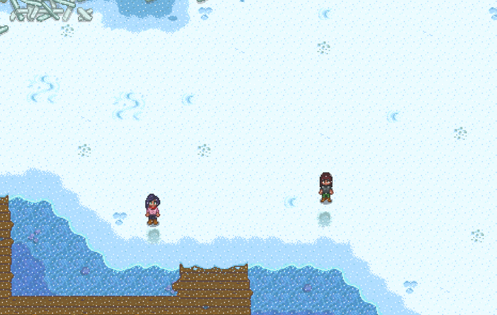

# 2 Player Marriage (Emily / Maru) Maru Notes

To be paired with [Emily Notes](./stardew_marriage_2p_intermediate_emily.md)

## Required Tech
- [Winter Forage Farming](../../../tech/winter_forage_farming.md)
- [Golden Crop Manipulation](../../../tech/golden_crop_manipulation.md)

## Setup

Emily Player should host the file  
Play as: Girl  

### Spring 1, Y1
- Plant parsnips in front of main house and water
- Sleep

### Spring 2, Y1
- Water parsnips
- Sleep

### Spring 4, Y1
- Water parsnips
- Sleep

### Spring 6, Y1
#### Maru
- Harvest parsnips
- Mark gold spot
- Reset if no golden parsnip was found
- Prepare planting spots for day 7
  
  ```
  ~~~6~~6~~~~
  ~7~~@~~~~~~
  ~~~~~~7~~7~
  ~~~~~~~~~~~
  ~~~6~~6~~~~
  ~~~~~~~~~~~
  ~~~7~~7~~~~
  
  Legend:
    @: Gold quality parsnip spot
    6: Plant cauliflower here here, harvest on 26th
    7: Plant cauliflower here, harvest on 27th
  ```
- Chop trees as time permits
- Go to Pierre's at 9am
- TALK TO PIERRE
- Sell Gold Parsnip + 5 regular parsnips (replace regular with silver, if any, for easier inventory)
- Buy 9 cauliflower seeds
- Pass out

### Spring 7, Y1
- Plant and fertilize cauliflower (craft basic fertilizer from sap)
  ```
  ~~~6~~6~~~~
  ~7~~@~~~~~~
  ~~~~~~7~~7~
  ~~~~~~~~~~~
  ~~~6~~6~~~~
  ~~~~~~~~~~~
  ~~~7~~7~~~~
  ```
- Sleep

Start watering cauliflower on the 15th through the 25th (+ any rain days)

### Spring 26, Y1
- Harvest cauliflowers plated on 6s (should all be gold quality)
```
~~~6~~6~~~~
~7~~@~~~~~~
~~~~~~7~~7~
~~~~~~~~~~~
~~~6~~6~~~~
~~~~~~~~~~~
~~~7~~7~~~~
```
- Sleep

### Spring 27, Y1
- Read all mail
- Harvest remaining cauliflower (should all be gold quality)
- Chop trees
- Break beach crates if time permits
- Gather spring forage (Keep a daffodil for Emily Player if possible)
- Gift a cauliflower to Maru in the lab in her house
- Sell all forage and parsnips to Pierre
- Cash out Journal
- Buy coffee at 12 (spend all money)
- Pass out

### Summer 10, Y1
- Chop trees
- Gift a cauliflower to Maru outside of her bedroom at 10am (or possibly later if it's raining)
- Pass out

### Winter 9, Y1
- Drink Coffee if available
- Winter forage farm at the beach (86), starting from one of the following spots
  
- Gift a cauliflower to Maru inside the clinic
- Pass out

### Winter 11, Y1
- Drink Coffee if available
- Winter forage farm  at the beach (86), starting from the same spot as Winter 9
- Gift a cauliflower to Maru inside the clinic
- Pass out

### Spring 24, Y2
- Chop Trees
- Flower Dance at 9am
- Talk to Everyone
- Sleep

### Spring 27, Y2
- Give all winter forage to Emily Player
- Chop Trees
- Gift a cauliflower to Maru in her bedroom at 9:30am
- Upgrade house at Robin's
- Pass out

### Summer 10, Y2
- Receive bouquet from Emily player
- Chop Trees
- Gift Maru a cauliflower, then the bouquet, then talk in her bedroom at 9am
- Pass out

### Summer 11, Y2
- Give Emily Player 1 Gold cauliflower
- SHIP EVERYTHING except for 2 Gold cauliflower. You only need 2 cauliflower, 1 for gifting and 1 for luau.
- Chop Trees
- Gift a cauliflower to Maru at 8:10am between Robin's house and the clinic (Maru walking to work)
- Luau at 9am (Gold cauliflower)

### Summer 13 (or 12 if raining), Y2
- Read all mail
- Chop trees as necessary for 300 wood
- Buy Mermaids Pendant
- Propose at 9am
- Pass out
