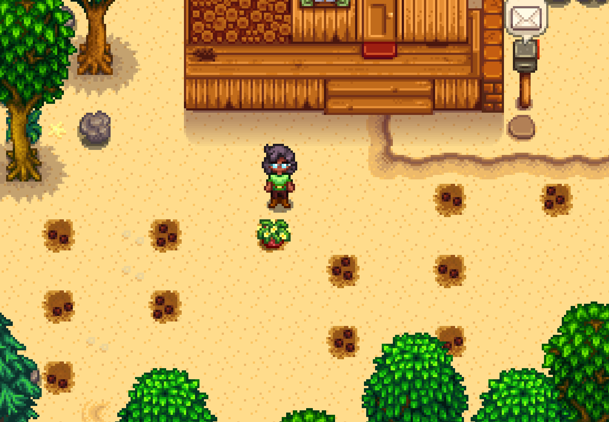
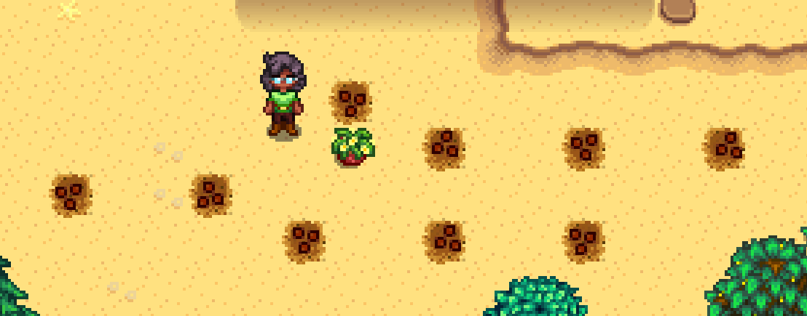
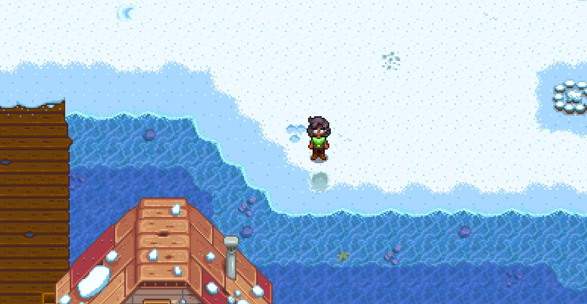

# 3 Player Marriage (Emily / Maru / Shane) Emily Notes

To be paired with [Maru Notes](./stardew_marriage_3p_intermediate_maru.md) and [Shane Notes](./stardew_marriage_3p_intermediate_shane.md)

## Required Tech
- [Winter Forage Farming](../../../tech/winter_forage_farming.md)
- [Crate Manipulation](../../../tech/crate_manipulation.md)
- [Parsnip Punching](../../../tech/parsnip_punching.md)
- [Mail Manipulation](../../../tech/mail_manipulation.md)

## Setup

Maru Player should host the file  
Play as: Girl  

## Miscellaneous notes

Emily loves:
- Amethyst, topaz, and other gems
- Survival Burger (which can be found in crates on the beach farm)
- Wool and Cloth (which Emily will send you in the mail)

Unlike most marriage routes which collect a consistent amount of gifts, all of Emily's gifts come from random sources. You'll need to use your judgement to decide if you have enough gifts or if you should spend time resetting mail or mining. Keep the following in mind:
- You need only 3 gifts total + 1 amethyst for the entire run
- You need at least 1 amethyst for quest purposes, do not leave the mines without one
- On Spring 27, Y1, 1 gift + 1 amethyst is usually good enough
- On Winter 9, when checking mail, you need 2 gifts + 1 amethyst total to finish the run, but you can also check beach crates and possibly get more mail as late as Spring 27, Y2

Other notes:
- In early spring and summer, the only resources you care about are wood and sap (for fertilizer). All other resources can be tossed. 
- After summer, Y1, only wood is needed
- Forage should be grabbed whenever possible and stashed in the chest
- Coffee should be used on winter 9th and 11th to speed up winter forage farming
- 1 coffee and 1 pepper poppers should be saved for Spring 27, Y2

## Route

### Spring 1, Y1
- Plant parsnips
- Water

### Spring 2, Y1
- Water parsnips

### Spring 4, Y1
- Water parsnips

### Spring 5, Y1
- Harvest 1 parsnip, toss on ground
- Toss all sap to Maru player
- Goto mines
- Get to floor 5
- Pass out via dwarf rock (9am)

### Spring 6, Y1
- Water all cauliflower spots
   
  ```
  ~~~~~~~~~~~~7~~7~
  ~6~~6~~@~~~~~~~~~
  ~~~~~~~~~6~~6~~~~
  ~7~~7~~~~~~~~~~~~
  ~~~~~~~~~7~~7~~~~
  ~6~~~~~~~~~~~~~~~
  
  Legend:
  @: Gold quality parsnip spot  
  6: Plant cauliflower here, harvest on 26th
  7: Plant cauliflower here, harvest on 27th  
  ```
- Sleep

### Spring 15-25, Y1
- Water cauliflower every day starting on the 15th (delaying by 1 day per rainy day)
- Sleep

### Spring 26, Y1
- Sleep

### Spring 27, Y1
- Dump scythe into chest
- Reset floor 5 for amethyst (wait 10 minutes between each reset). Ideally leave mines at 11:00am.
  
- Exhaust down to 1 stamina via dwarf rock
- Go to Emilys house 
- Gift a loved gift and talk to Emily outside her bedroom at 12pm
- Pass out

### Summer 1, Y1
- Assist Maru player preparing pepper spots
  
  ```
  ~~~~~~~1~~~~~~~~
  ~~~~~~~@~1~~1~~1
  ~0~~0~~~~~~~~~~~
  ~~~~~~0~~0~~0~~~
  Legend:
  @: Gold quality parsnip spot  
  0: Plant pepper here, harvest on 10th
  1: Plant pepper here, harvest on 11th 
  ```
- Chop trees
- Sleep when Maru player returns to farm

### Summer 6-9, Y1
- Water peppers every day starting on the 6th (delaying by 1 day per rainy day)
- Sleep

### Summer 10, Y1
- Dump watering can into chest, grab single cauliflower and half of all coffee from chest
- Chop trees
- Sleep at 10am

### Summer 11, Y1
- Chop trees as able
- Luau at 9am
- TALK TO EMILY and put cauliflower in the soup
- Sleep

### Summer 22, Y1
- Sleep, then hold Escape

### Winter 9, Y1
- Read all mail (with 3 inventory spaces empty for cloth, wool, and sea urchins)
- Dump resources into chest
- Drink coffee, if available
- Go to beach
- Winter forage farm at the beach, starting from shown tile (86 tiles)
  
- Gift a loved gift AND an amethyst AND talk to Emily in her bedroom at 9am (She leaves her house for Pierres at 10am)
- Go to Pierres, get 2,000 gold by selling forage and buy apricot sapling
- Pass out

### Winter 11, Y1
- Drink coffee, if available
- Plant Apricot Sapling at back of spouse area (to keep safe from debris)
  
- Go to beach 
- Winter forage farm starting from the same spot as winter 9 until all players have 500 forage between them (165 forage per player)
- Pass out

### Spring 20, Y2
- Harvest apricots
- Chop trees
- Sleep at 9:00am (7:30am if raining)

### Spring 27, Y2
- Take all winter forage and 1 pepper poppers from chest
- Consume pepper poppers
- Harvest apricots
- Chop trees until 1 stamina
- Drink coffee at 8:50am
- Gift a loved gift AND an Apricot AND talk to Emily in her bedroom at 9am 
- Go to Pierres
- Sell 30600 worth of winter forage, buy 3 bouquets
- Go to Robins
- Upgrade house at Robins
- Drop wood for other players, if needed
- Wait until EVERYONE has upgraded their house before passing out

### Summer 10, Y2
- Dump 2 bouquets into chest
- Chop trees until 1 stamina
- Bouquet and talk to Emily in her bedroom at 9am (Gift a loved gift if you have one, but not required)
- Pass out

### Summer 11, Y2
- Take 1 cauliflower from chest
- Hold onto 1 cauliflower, ship EVERYTHING else
- Chop down apricot tree and ship the sapling
- Chop trees as necessary
- Luau at 9am
- TALK TO EMILY and put cauliflower in the soup (If a gift was given on Summer 10, talking not necessary)
- Sleep

### Summer 13 (or summer 12 if raining), Y2
- Read all mail
- Chop trees as necessary for 300 wood
- Buy Mermaids Pendants
- Propose to Emily in her bedroom at 9am
- Pass out
- Sleep until win
