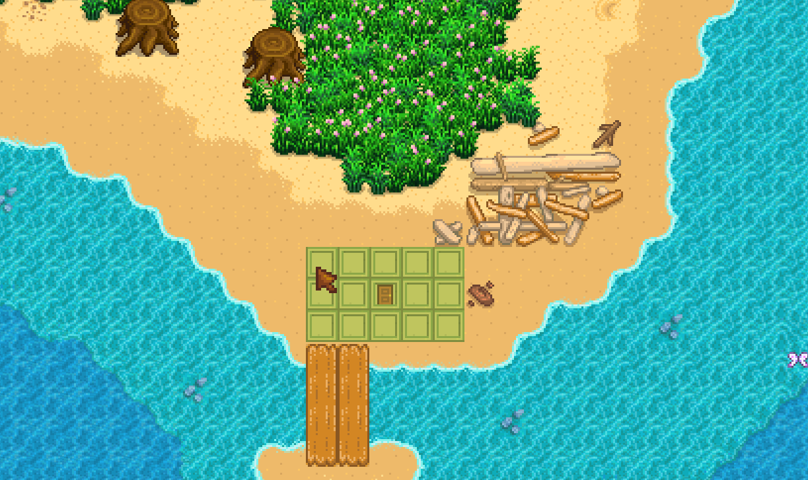
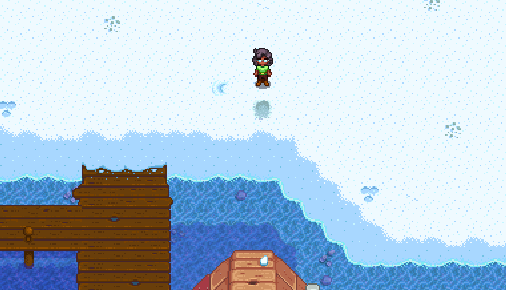

# 3 Player Marriage (Emily / Maru / Shane) Maru Notes

To be paired with [Emily Notes](./stardew_marriage_3p_intermediate_emily.md) and [Shane Notes](./stardew_marriage_3p_intermediate_shane.md)

## Required Tech
- [Winter Forage Farming](../../../tech/winter_forage_farming.md)
- [Golden Crop Manipulation](../../../tech/golden_crop_manipulation.md)

## Setup

Maru Player should host the file  
Play as: Girl  
Farm: Beach Farm  
Patch: 1.6 with Legacy RNG  

Extra options:
- Starting Cabins: 2
- Cabin Layout: Nearby
- Money Style: Separate

## Miscellaneous notes

- In early spring and summer, the only resources you care about are wood and sap (for fertilizer). All other resources can be tossed. 
- After summer, Y1, only wood is needed
- Forage should be grabbed whenever possible and stashed in the chest
- Coffee should be used on winter 9th and 11th to speed up winter forage farming

## Route

### Spring 1, Y1
- Plant parsnips
- Water

### Spring 2, Y1
- Water parsnips

### Spring 4, Y1
- Water parsnips

### Spring 5, Y1
- Harvest all parsnips, mark gold spot
- Prep cauliflower spots
   
  ```
  ~~~~~~~~~~~~7~~7~
  ~6~~6~~@~~~~~~~~~
  ~~~~~~~~~6~~6~~~~
  ~7~~7~~~~~~~~~~~~
  ~~~~~~~~~7~~7~~~~
  ~6~~~~~~~~~~~~~~~
  
  Legend:
  @: Gold quality parsnip spot  
  6: Plant cauliflower here, harvest on 26th
  7: Plant cauliflower here, harvest on 27th  
  ```
- Chop trees
- Sleep at 9am

### Spring 6, Y1
- Craft at least 11 fertilizer (ideally 20 for Summer crops as well as Spring)
- Fertilize all cauliflower spots
  ```
  ~~~~~~~~~~~~7~~7~
  ~6~~6~~@~~~~~~~~~
  ~~~~~~~~~6~~6~~~~
  ~7~~7~~~~~~~~~~~~
  ~~~~~~~~~7~~7~~~~
  ~6~~~~~~~~~~~~~~~
  ```
- Assist with watering, if necessary
- Sleep

### Spring 15-25, Y1
- Water cauliflower every day starting on the 15th (delaying by 1 day per rainy day)
- Sleep

### Spring 26, Y1
- Harvest cauliflower marked 6
  ```
  ~~~~~~~~~~~~7~~7~
  ~6~~6~~@~~~~~~~~~
  ~~~~~~~~~6~~6~~~~
  ~7~~7~~~~~~~~~~~~
  ~~~~~~~~~7~~7~~~~
  ~6~~~~~~~~~~~~~~~
  ```
- Sleep

### Spring 27, Y1
- Harvest remaining cauliflower
- Put 4 cauliflower into chest
- Chop trees until 1 stamina
- Check left side of farm for crates, keeping burgers/coffee
- Gift cauliflower and talk to Maru in the lab (Robins house) at 10am
- Move Shane players cabin to the south of the farm via Robin
   
- Go to Pierres and dump all sellable things at the counter for the Shane player to sell
- Go to Lewis' house and merge funds, and give all money to Shane Player
- Return home and sleep, or pass out

### Summer 1, Y1
- Prepare, water and fertilize spots for peppers
  
  ```
  ~~~~~~~1~~~~~~~~
  ~~~~~~~@~1~~1~~1
  ~0~~0~~~~~~~~~~~
  ~~~~~~0~~0~~0~~~
  Legend:
  @: Gold quality parsnip spot  
  0: Plant pepper here, harvest on 10th
  1: Plant pepper here, harvest on 11th 
  ```
- Grab 11 parsnips from chest
- Goto Pierres at 9am
- Sell 11 parsnips, buy 9 pepper seeds
- Return and plant all peppers
- Sleep

### Summer 6-9, Y1
- Water peppers every day starting on the 6th (delaying by 1 day per rainy day)
- Sleep

### Summer 10, Y1
- Harvest peppers marked 0
  ```
  ~~~~~~~1~~~~~~~~
  ~~~~~~~@~1~~1~~1
  ~0~~0~~~~~~~~~~~
  ~~~~~~0~~0~~0~~~
  ```
- Give all peppers to Shane player
- Read single letter from mail for fishing rod (if vanilla)
- Water all peppers
- Chop trees until 1 stamina
- Gift cauliflower and talk to Maru outside her bedroom at 10am
- Pass out

### Summer 11, Y1
- Harvest remaining peppers, give all to Shane player
- Water all peppers
- Dump watering can and scythe into chest, grab all coffee from chest
- Chop trees until 7:30am
- Gift cauliflower and talk to Maru walking to the clinic
- Luau at 9:00am
- Cauliflower in soup
- Sleep


### Summer 22, Y1
- Sleep, then hold Escape

### Summer 28, Y1
- Harvest all peppers and put into chest
- Sleep

### Winter 9, Y1
- Drink coffee, if available
- Go to beach
- Winter forage farm at the beach, starting from shown tile (86 tiles)
  
- Pass out

### Winter 11, Y1
- Drink coffee, if available
- Go to beach
- Winter forage farm starting from the same spot as winter 9 until all players have 500 forage between them (165 forage per player)
- Pass out

### Spring 20, Y2
- Dump all winter forage in chest
- Chop trees
- Sleep at 9:00am (7:30am if raining)

### Spring 27, Y2
- Grab all wood from chest
- Chop trees until 1 stamina (gifting at 9:30am instead of 9:00am today, so a bit of extra chopping time)
- Go to Robins
- Gift cauliflower and talk to Maru in Robins house
- Upgrade house at Robins
- Drop wood for other players
- Wait until EVERYONE has upgraded their house before passing out

### Summer 10, Y2
- Chop trees until 1 stamina
- Gift cauliflower and talk to Maru in her bedroom at 9am
- Pass out

### Summer 11, Y2
- Grab bouquet from chest
- Hold onto 2 cauliflower and bouquet, ship EVERYTHING else
- Chop trees until 7:30am
- Gift cauliflower AND bouquet AND talk to Maru walking to the clinic
- Luau at 9:00am
- Cauliflower in soup
- Sleep

### Summer 13 (or summer 12 if raining), Y2
- Read all mail
- Chop trees as necessary for 300 wood
- Buy Mermaids Pendants
- Propose to Maru in her bedroom at 9am
- Pass out
- Sleep until win
