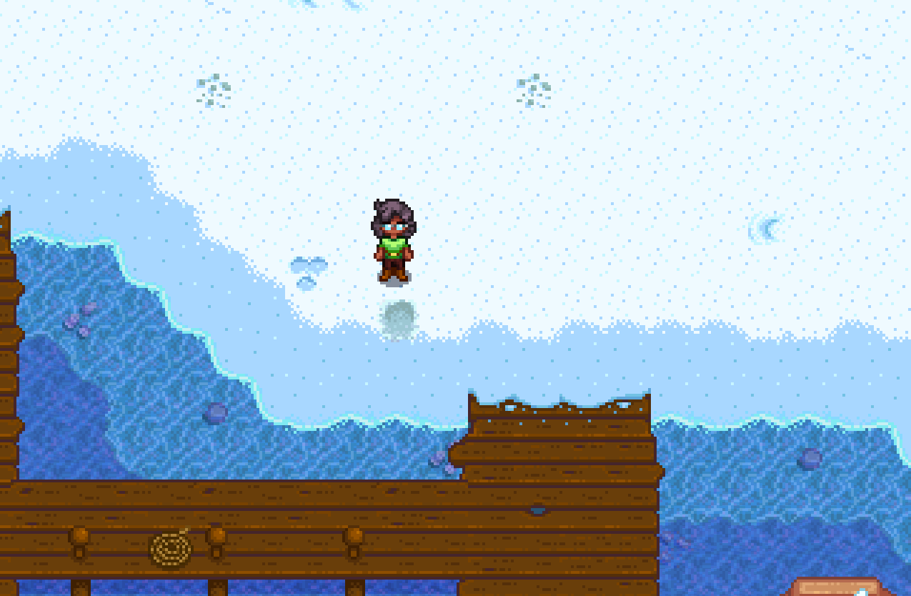

# 3 Player Marriage (Emily / Maru / Shane) Shane Notes

To be paired with [Emily Notes](./stardew_marriage_3p_intermediate_emily.md) and [Maru Notes](./stardew_marriage_3p_intermediate_maru.md)

## Required Tech
- [Winter Forage Farming](../../../tech/winter_forage_farming.md)

## Setup

Maru Player should host the file  
Play as: Girl  

## Miscellaneous notes

- In early spring and summer, the only resources you care about are wood and sap (for fertilizer). All other resources can be tossed. 
- After summer, Y1, only wood is needed
- Forage should be grabbed whenever possible and stashed in the chest
- Coffee should be used on winter 9th and 11th to speed up winter forage farming
- 1 coffee and 1 pepper poppers (+ 1 pepper poppers for the Emily player) should be saved for Spring 27, Y2

## Route

### Spring 1, Y1
- Plant parsnips
- Water

### Spring 2, Y1
- Water parsnips

### Spring 4, Y1
- Water parsnips

### Spring 5, Y1
- Harvest 1 parsnip, toss on ground
- Chop trees until 1 stamina
- Craft and place chest, dump scythe into chest
- Pass all sap to Maru player
- Receive all parsnips from Maru player
- Go to Pierres at 9am
- Sell 11 regular parsnips, Buy 11 Cauliflower seeds
- Pass out

### Spring 6, Y1
- Plant all cauliflower spots
   
  ```
  ~~~~~~~~~~~~7~~7~
  ~6~~6~~@~~~~~~~~~
  ~~~~~~~~~6~~6~~~~
  ~7~~7~~~~~~~~~~~~
  ~~~~~~~~~7~~7~~~~
  ~6~~~~~~~~~~~~~~~
  
  Legend:
  @: Gold quality parsnip spot  
  6: Plant cauliflower here, harvest on 26th
  7: Plant cauliflower here, harvest on 27th  
  ```
- Assist with watering, if necessary
- Sleep

### Spring 15-25, Y1
- Water cauliflower every day starting on the 15th (delaying by 1 day per rainy day)
- Sleep

### Spring 26, Y1
- Sleep

### Spring 27, Y1
- Grab everything sellable from chest (leave 11 parsnips)
- Chop trees until 1 stamina
- Go south checking all beach crates for coffee/burgers
- Ensure the space at the south of the farm is free of debris for house movement
   
- Gift parsnip to Shane after 9:00am (Catch him leaving his house at 7:15am if raining)
- Go to Pierres and sell everything (wait for Maru player to give you stuff at Pierres)
- Go to Saloon at noon, buy 2 beer, and as much coffee as possible
- Gift beer and talk to Shane in front of Emilys house
- Pass out

### Summer 1, Y1
- Distribute coffee among other players (ie: put two-thirds of coffee into chest)
- Grab single cauliflower from chest
- Chop trees as able
- Gift beer and talk to Shane outside his house at 7:15am
- Continue chopping trees
- Sleep in main cabin at 9:30am (when Maru player returns to farm)

### Summer 6-9, Y1
- Water peppers every day starting on the 6th (delaying by 1 day per rainy day)
- Sleep

### Summer 10, Y1
- Dump watering can into chest
- Collect peppers from Maru player
- Chop trees 
- Gift pepper and talk to Shane outside his house at 7:15am
- Chop more trees
- Sleep in southern cabin at 10:00am

### Summer 11, Y1
- Chop trees 
- Gift pepper and talk to Shane outside his house at 7:15am
- Chop more trees
- Luau at 9am
- Cauliflower in soup
- Sleep

### Summer 22, Y1
- Sleep, then hold Escape

### Winter 9, Y1
- Read all mail (leave 2 inventory spaces empty for pizza and pepper poppers)
- Drink coffee, if available
- Go to beach
- Winter forage farm, starting from shown tile (86 tiles)
  
- Leave beach at 8:10am to intercept Shane in town
- Gift pepper and talk to Shane in town
- Return to beach and finish winter forage farming pattern (86 tiles)
- Pass out

### Winter 11, Y1
- Go to beach
- Drink coffee, if available
- Winter forage farm
- Leave beach at 8:10am to intercept Shane in town
- Gift pepper and talk to Shane in town
- Return to beach and continue winter forage farming until all players have 500 forage between them (165 forage per player)
- Pass out

### Spring 20, Y2
- Dump all winter forage, pizza, and all but 1 pepper poppers into chest
- Chop trees
- Gift pepper and talk to Shane in his house at 9am (outside his house at 7:15am if raining)
- Sleep / Pass out at 9:00am (7:10am if raining)

### Spring 27, Y2
- Read all mail
- Consume pepper poppers
- Chop trees until 1 stamina
- Drink coffee at 8:50am
- Gift pepper and talk to Shane in his house at 9am
- Go to Robins
- Upgrade house at Robins
- Drop wood for other players, if needed
- Wait until EVERYONE has upgraded their house before passing out

### Summer 10, Y2
- Chop trees
- Gift pepper and talk to Shane outside his house at 7:15am
- Return to main cabin and dump all extra resources into chest
- Chop trees until 9:00am
- Sleep

### Summer 11, Y2
- Grab 1 cauliflower and bouquet from chest
- Hold 1 cauliflower, 2 gold peppers, and a bouquet, ship EVERYTHING else
- Chop trees as able
- Gift pepper AND bouquet AND talk to Shane outside his house at 7:15am
- Luau at 9am
- Cauliflower in soup
- Sleep

### Summer 13 (or summer 12 if raining), Y2
- Read all mail
- Chop trees as necessary for 300 wood
- Gift pepper and talk to Shane outside his house at 7:15am
- Buy Mermaids Pendants
- Propose to Shane en route to Joja mart
- Pass out
- Sleep until win
