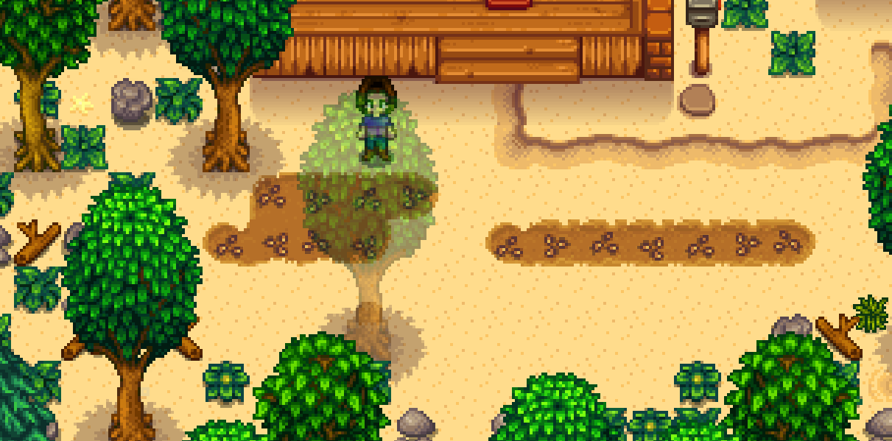
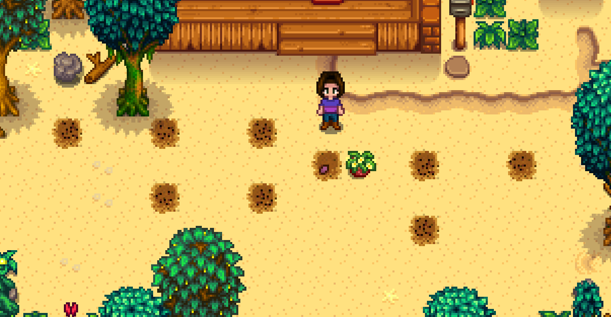

# Penny Marriage 

[Video of run](https://www.youtube.com/watch?v=H6xcidWv88o)

## Required Tech
- [Winter Forage Farming](../../tech/winter_forage_farming.md)
- [Rain Prediction](../../tech/rain_prediction.md)
- [Golden Crop Manipulation](../../tech/golden_crop_manipulation.md)

## Setup

Play as: Girl  
Farm: Beach Farm  
Patch: 1.6 with Legacy RNG  

## Route

### Spring 1, Y1

- Plant Parsnips
  
  ```
  ~~HHHHHHHHH~~~~
  ~~~~~~~P~~~~~~~
  ~T~~~~~PPPPPPP~
  ~~@@@@~~~~~~~~~
  ~@@@@~~@@@@@@@~
  ~~~~~~~~~~~~~~~
  
  Legend:
  P: Path in front of house
  H: House
  T: Tree
  @: Parsnip planting location
  ~: Beach
  ```
- Sleep

### Early Spring, Y1
- Reset on rainy 6th, 8th, 10th or 12th
- Reset on sunny 15th
- Reset on rainy 21st

### Spring 22, Y1
- Harvest Parsnips
- Mark Gold parsnip location
- Reset if no gold parsnip

### Summer 1, Y1
- Clear out spots for crops, chop at least 3 trees down for sap
- Water all spaces
- Fertilize all spaces with basic fertilizer (crafted from sap)
  
  ```
  6~~6~~6~~~~~~~~~~~~
  ~~~~~~~~M@~6~~6~~~~
  ~~~7~~7~~~~~~~~~~~~
  ~~~~~~~~~~~7~~~~~~~
  
  Legend:
  @: Gold quality parsnip spot
  M: Plant melon here, harvest on 26th
  6: Plant poppy here, harvest on 26th
  7: Plan poppy here, harvest on 27th
  ```
- Gift a regular parsnip and talk to Penny at 8:10am outside of her house (She leaves for the river north of Joja-mart)
- Sell all parsnips to Pierre
- Buy 1 melon + 8 poppies
- TALK TO PIERRE
- Return home and plant all crops
- Sleep

### Summer 2-14, Y1
- Count rainy days
- Sleep

### Summer 15-25, Y1
- Start watering melon on the 15th (delaying by 1 day per rainy day)
- Water melon 5 times by itself before starting to also water poppies

### Summer 26, Y1
- Harvest crops planted on 6s (should all be gold)
  ```
  6~~6~~6~~~~~~~~~~~~
  ~~~~~~~~6@~6~~6~~~~
  ~~~7~~7~~~~~~~~~~~~
  ~~~~~~~~~~~7~~~~~~~
  ```
- Sleep

### Summer 27, Y1
- Harvest remaining crops (should all be gold)
- Sleep
- A single regular quality Poppy is OK, as long as it isn't gifted on a birthday (Fall 2)

### Fall 2, Y1
- Chop trees
- Gift a poppy and talk to Penny in her house at 9am
- Leave her house to trigger 2 heart cutscene, answer with option 1: "I was. You did a kind thing there, Penny."
- Skip the cutscene as soon as you choose the text option
- Pass out

### Winter 8, Y1
- Read single letter from mailbox for fishing rod
- Winter forage farm on the beach (85)
- Gift a poppy and talk to Penny in her house or reading near graveyard
- Pass out

### Winter 11, Y1
- Winter forage farm on the beach (86), starting from the same tile.
- Gift a poppy and talk to Penny in her house or reading near graveyard
- Pass out

### Spring 1, Y2
- Chop Trees
- Gift a poppy and talk to Penny outside of her house or reading near graveyard at 8:10am
- Answer Penny with option 1: "Right. It's best to be positive"
- Pass out

### Spring 24, Y2
- Chop trees
- Gift a poppy and talk to Penny at 9am outside of her house
- Flower dance
- Talk to everyone
- Dance with Penny
- Sleep

### Summer 11, Y2
- Chop trees
- Gift a poppy and talk to Penny at 8:10am outside of her house
- Go to beach for Luau, put golden quality melon in soup
- Sleep

### Summer 12, Y2
- Chop trees
- Consume coffee if available at 8:50am
- Enter Penny's house at 9am, skip the first cutscene (4 heart cutscene) but watch the second (6 heart cutscene)
- Answer with option 1: "(Lie) Mmm! That was delicious"
- Skip the cutscene as soon as you choose the text option
- Gift a poppy and talk to Penny
- Go to Pierre's and sell all winter forage
- Buy Bouquet
- Go to Robin's and upgrade house
- Pass out, or walk back to farm if you have a clear path and have consumed coffee

### Fall 2, Y2
- Read mail for up to 1000g if necessary (5000g required for pendant)
- Chop trees if necessary (300 wood required for bridge)
- Be ready to give bouquet to Penny outside of her house at 8:10 (50% chance that she leaves for the library at 8:10, otherwise she will be in her house all day, go in at 9am)
- Gift bouquet, then poppy, then talk to Penny
- Go to beach and buy mermaids pendant
- Propose
- Pass out
- Sleep until win
