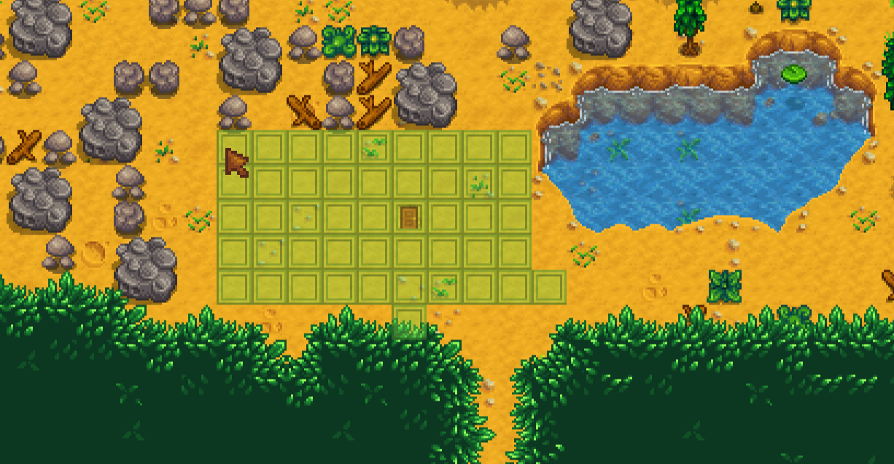
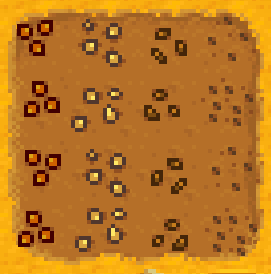
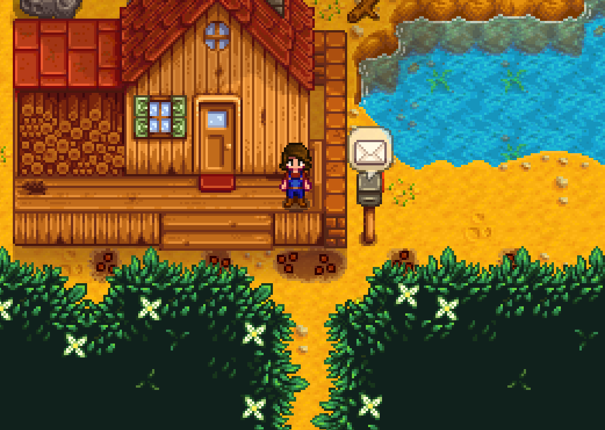

TODO: Create doc for winter forage farming outside of Shanes house

# Shane Marriage 

[Video of run](https://www.youtube.com/watch?v=Qu2HCELQ33Q)

## Required Tech
- [Winter Forage Farming](../../tech/winter_forage_farming.md)
- [Rain Prediction](../../tech/rain_prediction.md)
- [Golden Crop Rain Relation](../../tech/golden_crop_rain_relation.md)

## Setup

Play as: Girl  
Farm: Forest Farm  
Patch: 1.6 with Legacy RNG  

## Route

- Sleep until Spring 20, Y1
- Reset on rainy 6th
- Reset on sunny 7th
- Reset on rainy 11th

### Spring 20, Y1
- Chop trees
- Get 24+ mixed seeds
- Clear out space at bottom of farm for house movement
- Leave farm by 11am, head to Robin's
- Move house to bottom of farm at Robin's
  
- Buy up to 50 wood from Robin if you are confident that you have enough forage money for beers
- Sell all forage to Pierre
- Buy 2 beer, and 2 coffee (if able) from saloon at 12pm
- Gift beer and talk to Shane as he walks into town
- Pass out

### Summer 1, Y1

- Plant peppers (via mixed seeds) and water. Need 5 pepper plants. Identify peppers via seed shape, uproot bad seeds with pickaxe.   Left to right, these are pepper seeds, corn seeds, radish seeds, and wheat seeds.  
     
- Plant peppers in the following spots
  
  ```
  HHHSSSHHM~~~~
  ~X~~X~XX~X~~X
  
  Legend:
  H: House
  S: Steps of house
  M: Mailbox
  X: Plant peppers here
  ```
- Gift beer and talk to Shane outside his house at 7:15am
- (Optional) Place chair outside Shane's house if you're confident

### Rest of summer, Y1

- Water peppers on the 13th - 16th (delaying by 1 day per rainy day)
- Harvest peppers on the 17th
- Water peppers on the 23rd - 25th (delaying by 1 day per rainy day)
- Harvest peppers on the 26th
- Reset if no gold quality pepper

### Winter 2, Y1
- Winter forage farm outside of Shane's house (20)
- Chop trees as able
- Gift pepper and talk to Shane outside his house at 7:15am
- Sleep

### Winter 3, Y1
- Winter forage farm outside of Shane's house (38)
- Gift pepper and talk to Shane outside his house at 7:15am
- Sleep

### Winter 9, Y1
- Winter forage farm outside of Shane's house (20)
- Chop trees as able
- Gift pepper and talk to Shane outside his house at 7:15am
- Sleep

### Winter 10, Y1
- Winter forage farm outside of Shane's house (38)
- Gift pepper and talk to Shane outside his house at 7:15am
- Sleep

### Winter 16, Y1
- Winter forage farm outside of Shane's house (20)
- Chop trees as able
- Gift pepper and talk to Shane outside his house at 7:15am
- Sleep

### Winter 17, Y1
- Winter forage farm outside of Shane's house (38)
- Gift pepper and talk to Shane outside his house at 7:15am
- Sleep

### Winter 23, Y1
- Chop trees as able
- Gift pepper and talk to Shane outside his house at 7:15am
- Sleep

### Spring 20, Y2
- Check all mail
- Eat pepper poppers if available
- Chop trees
- Drink coffee at 8:50am if available
- Gift gold quality pepper and talk to Shane in his house at 9am
- Go to Pierre's
- Sell all winter forage, pizzas, and all but 1 pepper poppers, buy bouquet
- Go to Robin's
- Upgrade house
- Pass out

### Spring 24, Y2
- Go to Cindersap forest before 6:10am
- Chop trees
- Gift bouquet, then pepper to Shane outside his house at 7:15am
- Return to farm
- Continue chopping trees as able
- Flower Dance at 9am
- DO NOT talk to everyone
- Dance with Shane
- Sleep

### Spring 25
- Eat pepper poppers and drink coffee if available
- Check mail for up to 1,000g if necessary (need 5,000g)
- Chop trees as necessary (need 300 wood)
- Gift pepper and talk to Shane outside his house at 7:15am
- Buy mermaids pendant
- Propose to Shane on his way to work
- Return home and sleep, or pass out
- Sleep until win
