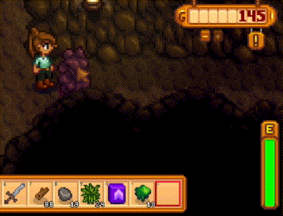

# Parsnip Punching

Parsnip Punching is tech which allows you to exhaust yourself extremely quickly, which is helpful for passing out when you want.

## Overview

Parsnip Punching is relatively simple. You need to:
- Select an empty slot in your inventory (ie: not be holding an item or tool)
- Stand next to the box of parsnips in your house
- Mouse over the box of parsnips in your house (cannot be done on controller)
- Alternate left-clicking and pressing "c" on your keyboard as fast as possible

This drains stamina at a very fast rate, allowing you to set up your stamina level where you need it for the day. The below GIFs are not sped up, they are at normal game speed.

https://github.com/uppercasserole/stardew_marriage_speedruns/raw/refs/heads/video_test/img/parsnip_punching.mp4

## Example

In an Emily marriage speedrun, we leave from the mines heading to Emily's house, from which we want to pass out to return home quickly. As we leave the mines, we punch the dwarf rock until we have 1 stamina left so that we can pass out quickly from Emily's house.
