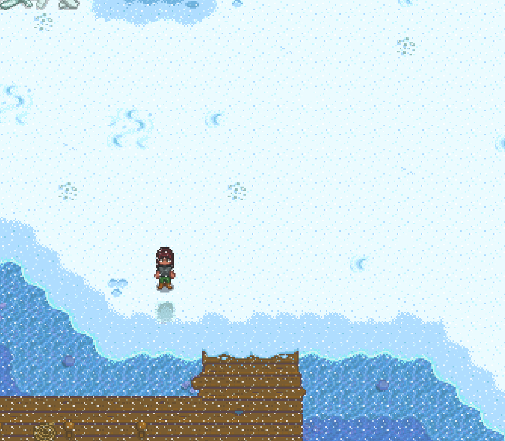
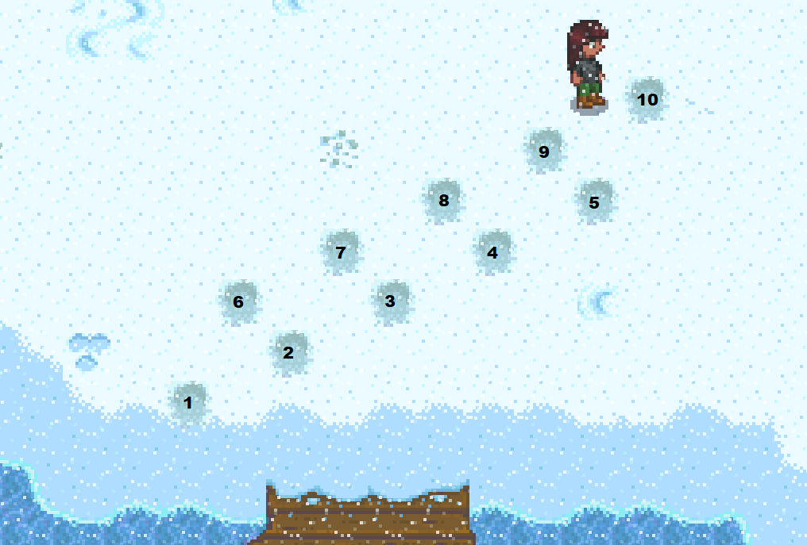
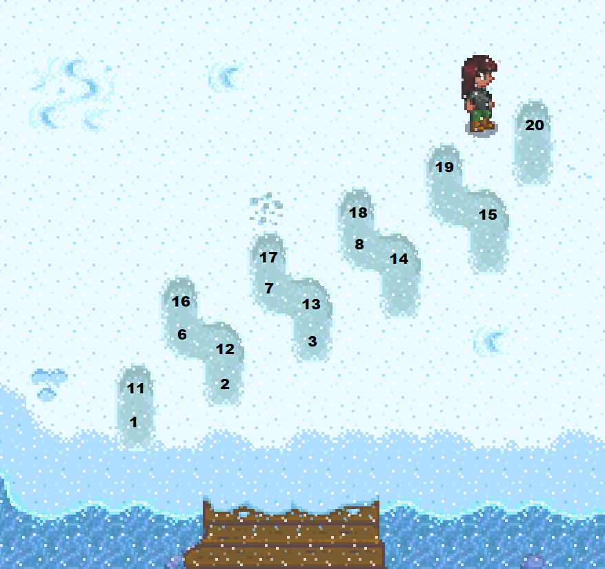

# Winter Forage Farming

Winter forage farming is a form of RNG prediction allowing us to till up a large quantity of winter forage which is used as a quick way to make gold.  This tech can be done on patch 1.5, or patch 1.6 with legacy RNG enabled.

## Overview

