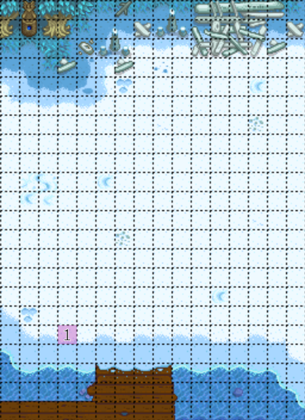
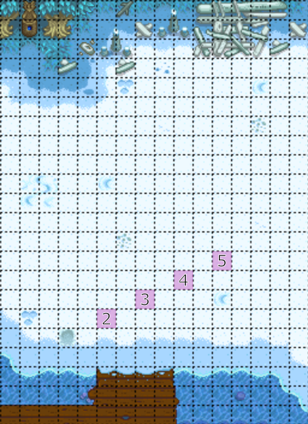
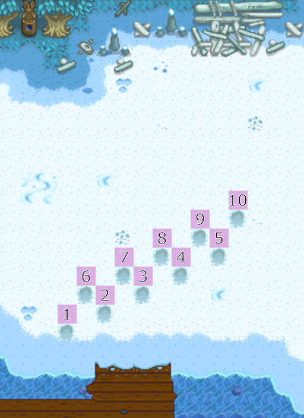

# Winter Forage Farming

Winter forage farming is a form of RNG prediction allowing us to till up a large quantity of winter forage which is used as a quick way to make gold.  This tech can be done on patch 1.5, or patch 1.6 with legacy RNG enabled.

## Overview

Winter forage farming can be done anywhere where the ground is tillable, but it is most commonly done on the beach as it the largest area of clear tillable land that we have access to.

Note that this can only be done on patch 1.5, or patch 1.6 WITH LEGACY RNG ENABLED. If your farm does not have legacy RNG enabled, you WILL NOT be able to do this tech.

You can begin on any tile you like, but the tile pictured below is recommended. It gives you a very large amount of space to work with and is relatively easy to find using the dock, the shore and the snowbank as reference. Till the tile, and if no winter forage appears, un-till with your pickaxe and till again until winter forage spawns.

Once you have found winter forage, proceed to till to the right and upwards in a knights move pattern. You should be getting winter forage with every till.

After 5 tills, do the next 5 tills as shown below.

You've done one complete "row" of the winter forage pattern. Now simply repeat those same 10 tills, but start 1 tile north of where you originally started.

Repeat this pattern as many times as you need.

## Notes
- If you hit an incorrect tile by accident, simply proceed with the pattern as if you had hit the correct tile (ie: skip the tile that you "missed"). You can always un-till tiles to clean up mistakes, as un-tilling does not advance the forage pattern, only tilling.
- Occasionally, you may hit the correct tile, but you will get no forage. This does happen and is no fault of your own. If your pattern "breaks" like this, simply un-till and re-till the broken tile *twice*, and you should get winter forage again. Then just continue the pattern as normal.

## Examples

In the [Penny intermediate route](../routes/penny/stardew_marriage_penny_intermediate.md) the notes on Winter 8, Y1 say:

> ### Winter 8, Y1
> - Read single letter from mailbox for fishing rod
> - Winter forage farm on the beach (85)
> - Gift a poppy and talk to Penny in her house or reading near graveyard
> - Pass out
> 
> ### Winter 11, Y1
> - Winter forage farm on the beach (86), starting from the same tile.
> - Gift a poppy and talk to Penny in her house or reading near graveyard
> - Pass out

This means that you should do winter forage farming on the beach, tilling *exactly* 85 tiles. The reason for the exact number is that it sets up the forage pattern for the following outing.
Note on how Winter 11, it says "_(86) starting from the same tile_". If you tilled exactly 85 tills on winter 8, then starting from the same tile should give you winter forage IMMEDIATELY on winter 11. If you miscount, you will simply need to "find" the pattern again by un-tilling and re-tilling the first tile.

## Do it yourself

Winter forage patterns can be figured out yourself using [BlaDe's Predictor](https://www.nexusmods.com/stardewvalley/mods/6614).
