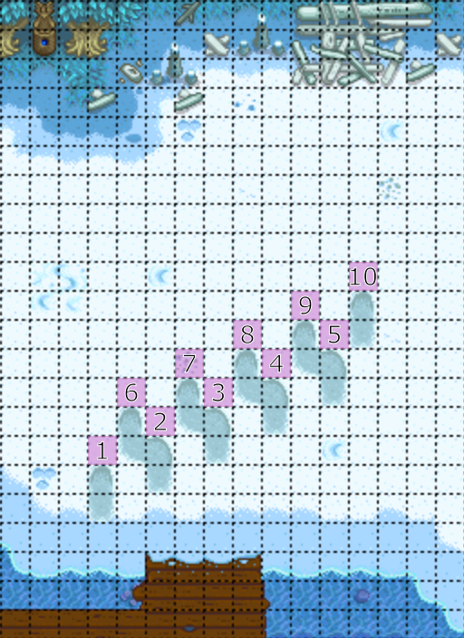

# Winter Forage Farming

Winter forage farming is a form of RNG prediction allowing us to till up a large quantity of winter forage which is used as a quick way to make gold.  This tech can be done on patch 1.5, or patch 1.6 with legacy RNG enabled.

## Overview

Winter forage farming can be done anywhere where the ground is tillable, but it is most commonly done on the beach as it the largest area of clear tillable land that we have access to.

You can begin on any tile you like, but the tile pictured below is recommended. It gives you a very large amount of space to work with and is relatively easy to find using the dock, the shore and the snowbank as reference. Till the tile, and if no winter forage appears, un-till with your pickaxe and till again until winter forage spawns.

Once you have found winter forage, proceed to till to the right and upwards in a knights move pattern. You should be getting winter forage with every till.

After 5 tills, do the next 5 tills as shown below.

You've done one complete "row" of the winter forage pattern. Now simply repeat those same 10 tills, but start 1 tile north of where you originally started.

Repeat this pattern as many times as you need.

