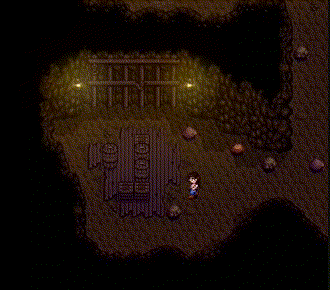

# Crate Manipulation

Crate manipulation is tech which allows the contents of crates in the mines to be predicted. This tech can be done on patch 1.5, patch 1.6 with Legacy RNG, and 1.6 without legacy RNG, though the specific manipulated crate locations will be different for each.

## Overview

The "random" contents of a crate is determined completely by
- The in-game date
- The floor
- The location of the crate on the floor

Notably, the game seed has NO effect on the content of crates. This means that in any game a crate in the same location on the same floor on the same in-game day will always contain the same item.

Crate manipulation is simply knowing that a particular crate location on a specific floor/day contains the item that you want. Every time you leave a floor and re-enter, crates will move around randomly. So by leaving and returning to the same floor over and over again, you can check for a crate in the specific spot that you want.

## Example

In an Emily marriage speedrun, we always go to the mines on the 27th of Spring, Year 1 looking for amethyst. It so happens that on floor 5, there is a large group of crates, one of which will always contain an amethyst.

The floor can be reset repeatedly, looking for a crate in that specific spot. Whenever a crate spawns there, you can break that one crate, grab the amethyst, and then reset the floor again looking for another crate in the same spot.

## Do it yourself

You can use [BlaDe's Predictor](https://www.nexusmods.com/stardewvalley/mods/6614) to analyze any floor/day combination for any items.
