# Winter Forage Farming in Town

A fancier version of [Winter Forage Farming](winter_forage_farming.md), we can winter forage farm in town in front of Pam's house. This gets us much less forage than on the beach, but it is convenient for some categories as you don't need to walk all the way to the beach.

## Overview

Very similar to regular winter forage farming, but the pattern is going to be a bit more complex. If you are comfortable with the regular [Winter Forage Farming](winter_forage_farming.md) pattern, then this should be relatively simple to learn.

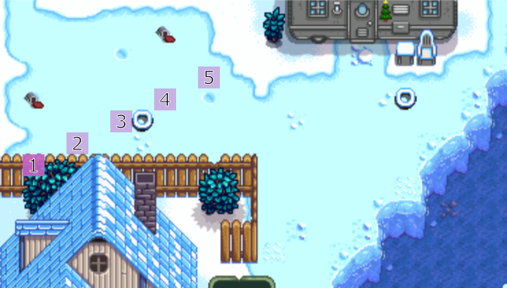
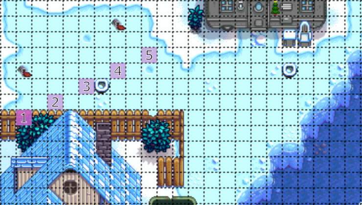

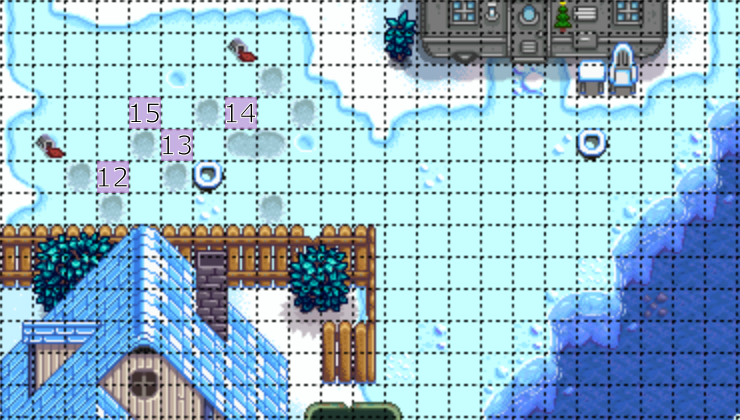

After tilling 15, you should un-till 15 as we will be tilling it again momentarily.

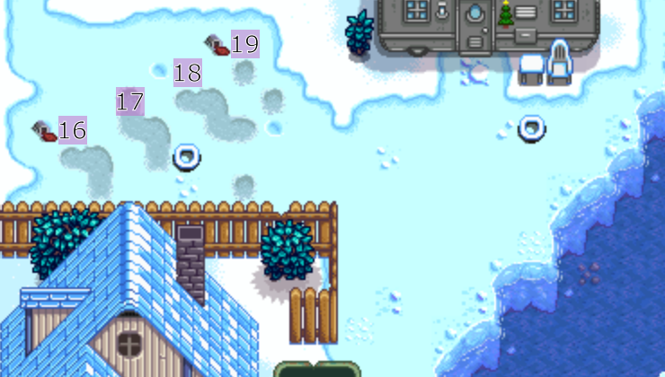

After doing these 19 tills, we move over to the lower section

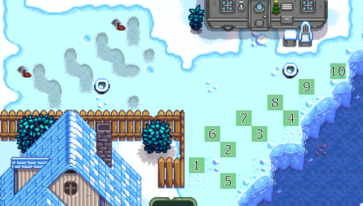
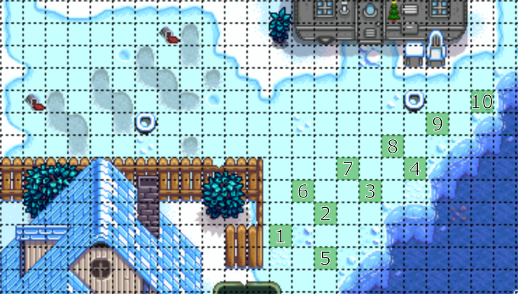

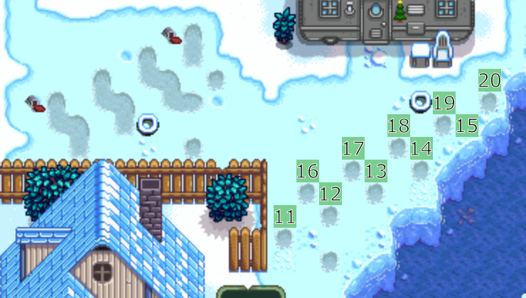
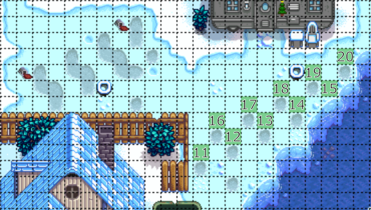

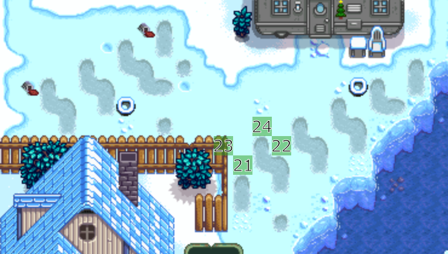
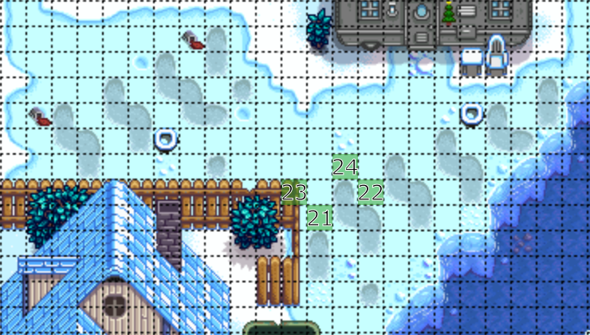

### Entire pattern at once

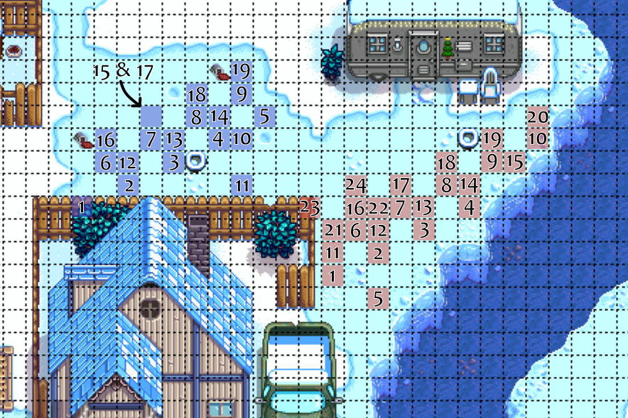
